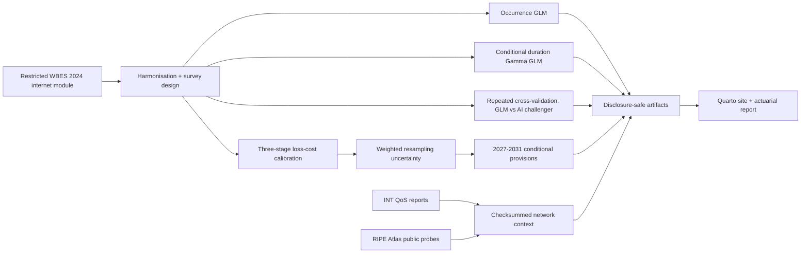

# Tunisia Internet-Interruption Risk

[](https://books.ropensci.org/targets/)
[](https://rstudio.github.io/renv/)
[](LICENSE)
[](https://github.com/aminemanai2003/tunisia-internet-interruption-risk/actions/workflows/pages.yml)

An independent actuarial study of self-reported business loss associated with internet interruptions in Tunisia. It combines survey-weighted occurrence and duration modelling, a three-stage loss-cost calibration, repeated cross-validation, a governed machine-learning challenger, official INT quality-of-service evidence, a RIPE Atlas measurement snapshot and conditional 2027-2031 provisions.

**Public study:** <https://aminemanai2003.github.io/tunisia-internet-interruption-risk/>

**PDF report:** <https://aminemanai2003.github.io/tunisia-internet-interruption-risk/reports/actuarial-report.pdf>

## Results at a glance

- Among 616 valid connected-business responses in Tunisia's 2024 WBES, the survey-weighted internet-disruption rate is **19.83%**.
- Affected businesses with usable duration data report a weighted mean duration of **1.96 hours**.
- The calibrated expected loss ratio is **0.252% of annual-sales exposure**, with a weighted-resampling interval of **0.093% to 0.458%**.
- Per 10 million TND of starting exposure, the persistent-condition provision is **30,293 TND in 2027** and **32,790 TND in 2031**.
- The actuarial GLM has a mean weighted cross-validated AUC of approximately **0.69**; the gradient-boosting challenger is weaker and remains evaluation-only.
- The severity GLM and operator-attribution gates are blocked: only 16 positive percentage-loss responses exist and WBES contains no provider identifier.

These are portfolio-scale conditional illustrations, not national loss estimates, operator forecasts, insurance premiums, statutory provisions or booked reserves.

## Architecture



## Actuarial framework

The baseline loss ratio is

$$
\widehat{ELR}
=\widehat{\Pr}_w(\text{disruption})
\times\widehat{\Pr}_w(\text{positive loss}\mid\text{disruption})
\times\widehat{\mathbb E}_w[\text{loss ratio}\mid\text{positive loss}].
$$

For scenario $s$ and year $t$, the management provision is

$$
P_{s,t}=E_{s,t}\widehat{ELR}_{2024}m_s(1+g_s)^{t-2027}(1+\lambda_s).
$$

Every exposure, stress, trend and prudence assumption is versioned in [`config/scenarios.csv`](config/scenarios.csv).

## Operator boundary

The survey does not identify the establishment's provider. Business losses therefore cannot be assigned to Tunisie Télécom, Ooredoo Tunisia, Orange Tunisia or another provider. Operator-level INT evidence and RIPE Atlas network evidence remain separate contextual layers.

## Data boundary

The firm-level WBES panel and downloaded source PDFs are ignored by Git. Only aggregate, disclosure-screened outputs under [`artifacts/public`](artifacts/public) are published. Public INT downloads retain source URLs, timestamps, sizes and SHA-256 checksums.

Primary sources:

- [World Bank Tunisia Enterprise Survey panel dictionary](https://microdata.worldbank.org/catalog/8157/data-dictionary/F1?file_name=Tunisia+_2013_2020_2024_)
- [INT mobile QoS reports](https://intt.tn/fr/index-qos-2g-3g-4g-265-363.html)
- [INT fixed-internet QoS reports](https://intt.tn/fr/index-qos-internet-265-398.html)
- [RIPE Atlas APIs](https://atlas.ripe.net/docs/apis/)

## Reproduce locally

Requirements: R 4.6+, Python 3.11+, Quarto 1.6+, XeLaTeX and a locally authorized copy of `Tunisia_2013_2020_2024.dta` at `data/raw/wbes/`.

```powershell
Rscript -e "renv::restore(prompt = FALSE)"
python -m pip install -e .
./scripts/run_all.ps1
```

The build collects public context, evaluates the AI challenger, runs the `targets` pipeline, executes tests, checks the public boundary, renders the website and creates the PDF report.

## Repository map

```text
R/                     survey ingestion, estimators, models and projections
scripts/               network collection, ML challenger and release controls
config/                versioned scenario assumptions
tests/                 data-contract and actuarial-identity tests
artifacts/public/       disclosure-safe tables, figures and model card
reports/                technical report source and PDF
site/                   visual system and render helpers
docs/                   rendered GitHub Pages site (generated locally)
```

## License and citation

Code is released under the [MIT License](LICENSE). Cite the repository using [`CITATION.cff`](CITATION.cff) and cite each underlying data provider separately.
