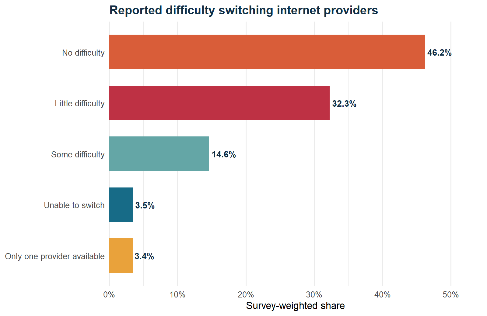
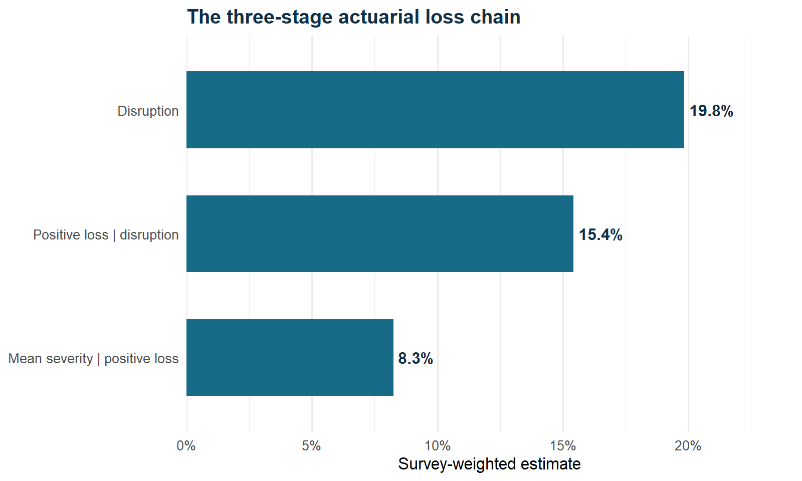
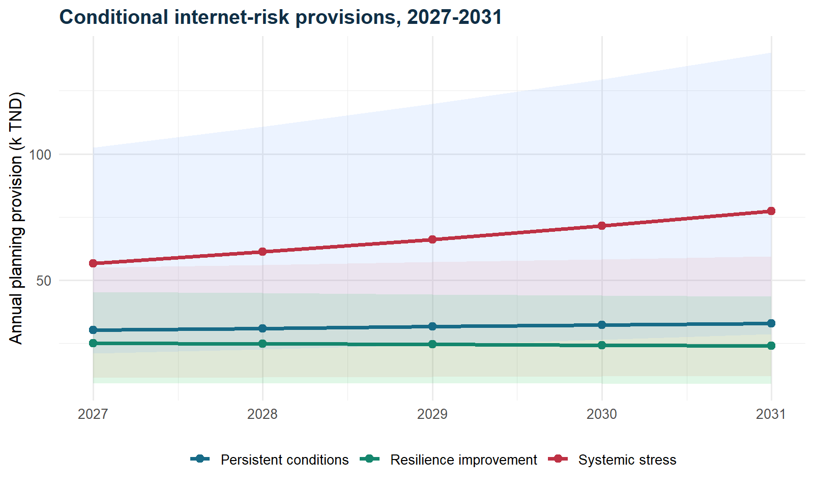

```{r}
#| include: false
if (file.exists("site/helpers.R")) source("site/helpers.R") else source("../site/helpers.R")
persistent_2027 <- projection_row("persistent", 2027)
systemic_2031 <- projection_row("systemic", 2031)
```

# Executive summary

This study develops a disclosure-safe actuarial framework for self-reported economic loss associated with internet interruptions among formal businesses represented by Tunisia's 2024 World Bank Enterprise Survey (WBES). It combines survey-weighted estimation, a conditional Gamma duration model, repeated cross-validation, a governed machine-learning challenger, public telecommunications evidence and explicit 2027-2031 planning scenarios.

The usable connected-business sample contains `r evidence$connected_usable_n` establishments and `r evidence$disruption_events` reported disruption events. The survey-weighted disruption rate is `r fmt_pct(evidence$disruption_rate_weighted)`. Among disrupted businesses, the loss-ratio field has `r evidence$loss_ratio_usable_n` usable responses and only `r evidence$positive_loss_events` positive values. This small severity base is the dominant limitation.

The calibrated expected loss ratio is `r fmt_ratio_pct(calibration$expected_loss_ratio)` of annual-sales exposure. Its weighted-resampling interval is `r fmt_ratio_pct(bootstrap$lower_95)` to `r fmt_ratio_pct(bootstrap$upper_95)`. For a standardized 10 million TND exposure, the persistent-condition scenario gives a 2027 risk-adjusted provision of `r fmt_tnd(persistent_2027$risk_adjusted_provision_tnd)`. The 2031 systemic-stress illustration reaches `r fmt_tnd(systemic_2031$risk_adjusted_provision_tnd)`.

These amounts are conditional management risk budgets. They are not national loss estimates, insurance premiums, statutory technical provisions, booked reserves or forecasts of any telecommunications operator.

# Scope, data and estimand

## Restricted business survey

The source file is the Tunisia WBES 2013-2020-2024 panel, but the internet-interruption module used here is available only for the 2024 wave [@worldbank2024]. Raw microdata remain local. Only aggregate results satisfying disclosure controls are published.

The 2024 module supplies:

- disruption occurrence;
- average disruption hours and minutes;
- losses as a percentage of annual sales;
- monetary losses;
- difficulty switching providers;
- annual fixed-broadband cost;
- survey weight and establishment characteristics.

The primary occurrence estimand is the weighted share of connected formal establishments with a valid response that reported an internet disruption in the previous fiscal year. It is not a network uptime statistic and does not cover households or informal businesses.

## Public network context

Two official reports from the Instance Nationale des Telecommunications (INT) are collected with URLs and SHA-256 checksums. The 2019 mobile campaign measured 3G/4G service in Grand Tunis for Tunisie Telecom, Ooredoo Tunisia and Orange Tunisia [@intmobile2019]. The 2020 fixed campaign evaluated 8 Mbps ADSL service across 24 governorates and five internet service providers [@intfixed2020].

A current public RIPE Atlas probe snapshot describes the available measurement footprint by autonomous system [@ripeatlas]. Probe counts are not market share, service quality or outage frequency.

## Separation rule

The sources are deliberately kept separate:

$$
\text{WBES business loss}\;\not\Rightarrow\;\text{operator attribution},
$$

because WBES does not identify the provider. INT and RIPE Atlas evidence provides system context but is never joined to individual business records.

# Descriptive evidence

## Occurrence, duration and switching

```{r}
#| label: tbl-report-evidence
#| tbl-cap: "Core 2024 survey evidence"
display <- data.frame(
  Measure = c(
    "Raw establishment records", "Valid connected-business responses",
    "Effective occurrence sample", "Reported disruptions", "Weighted disruption rate",
    "Usable duration responses", "Weighted mean duration",
    "Weighted provider-switch constraint rate"
  ),
  Estimate = c(
    evidence$raw_n,
    evidence$connected_usable_n,
    fmt_num(evidence$effective_n),
    evidence$disruption_events,
    fmt_pct(evidence$disruption_rate_weighted),
    evidence$duration_usable_n,
    paste0(fmt_num(evidence$mean_duration_hours_weighted), " hours"),
    fmt_pct(evidence$provider_switch_constraint_rate_weighted)
  ),
  check.names = FALSE
)
knitr::kable(display, booktabs = TRUE, align = c("l", "r"))
```

Hours and minutes are combined as

$$
D_i=
\begin{cases}
H_i, & H_i>0,\\
M_i/60, & H_i=0 \text{ and } M_i \text{ observed},\\
\text{missing}, & \text{otherwise}.
\end{cases}
$$

This rule preserves the survey's less-than-one-hour structure and does not turn unknown minutes into zero.

{fig-alt="Horizontal bars showing reported difficulty switching internet providers." width=88%}

The switching indicator groups one-provider-only, unable-to-switch and some-difficulty responses. It is a descriptive resilience indicator, not a causal predictor or competition-law conclusion.

## Loss-cost components

{fig-alt="Horizontal bars for the three components of expected internet-interruption loss cost." width=88%}

```{r}
#| label: tbl-report-loss-chain
#| tbl-cap: "Survey-weighted actuarial loss-chain calibration"
display <- data.frame(
  Component = c(
    "Disruption probability", "Positive loss probability given disruption",
    "Mean positive loss ratio", "Expected loss ratio"
  ),
  Estimate = c(
    fmt_pct(calibration$disruption_probability),
    fmt_pct(calibration$positive_loss_probability_given_disruption),
    fmt_ratio_pct(calibration$mean_positive_loss_ratio),
    fmt_ratio_pct(calibration$expected_loss_ratio)
  ),
  check.names = FALSE
)
knitr::kable(display, booktabs = TRUE, align = c("l", "r"))
```

# Actuarial framework

## Survey-weighted occurrence

For establishment $i$, let $I_i\in\{0,1\}$ be the disruption indicator and $w_i$ its survey weight. Following standard design-based estimation [@lumley2010],

$$
\widehat p
=\frac{\sum_{i=1}^{n}w_iI_i}{\sum_{i=1}^{n}w_i},
\qquad
n_{\mathrm{eff}}
=\frac{\left(\sum_iw_i\right)^2}{\sum_iw_i^2}.
$$

The occurrence GLM is

$$
I_i\sim\operatorname{Bernoulli}(p_i),
\qquad
\operatorname{logit}(p_i)
=\beta_0+\beta_R^\top R_i+\beta_S^\top S_i+\beta_Z^\top Z_i,
$$

with region, sector and firm size as categorical covariates. The specification is intentionally parsimonious relative to 136 events.

## Conditional duration

For $D_i>0$, duration is capped at its 99th percentile:

$$
D_i^*=\min(D_i,Q_{0.99}),
\qquad
D_i^*\mid I_i=1\sim\operatorname{Gamma}(\mu_i,\phi),
\qquad
\log\mu_i=x_i^\top\gamma.
$$

The cap reduces leverage from the maximum 48-hour response while retaining the record. Duration is conditional on having a reported interruption and a usable positive duration.

## Expected loss ratio

The loss-cost decomposition follows the frequency-severity logic used in non-life actuarial work [@ohlsson2010]:

$$
\widehat{ELR}_{2024}
=\widehat p\,\widehat q\,\widehat\mu_+,
$$

where

$$
\widehat p=\widehat{\Pr}_w(I=1),
\qquad
\widehat q=\widehat{\Pr}_w(L>0\mid I=1),
\qquad
\widehat\mu_+=\widehat{\mathbb E}_w[L\mid L>0,I=1].
$$

Numerically,

$$
`r formatC(calibration$disruption_probability, digits = 6, format = "f")`
\times
`r formatC(calibration$positive_loss_probability_given_disruption, digits = 6, format = "f")`
\times
`r formatC(calibration$mean_positive_loss_ratio, digits = 6, format = "f")`
=
`r formatC(calibration$expected_loss_ratio, digits = 7, format = "f")`.
$$

A monetary-severity model is rejected because only eight monetary values exist. A percentage-loss severity GLM is also rejected because only 16 strictly positive responses exist.

## Weighted resampling uncertainty

For $b=1,\ldots,2000$, a pseudo-population sample is drawn with replacement using

$$
\pi_i=\frac{w_i}{\sum_jw_j}.
$$

The complete three-stage estimator is recomputed in each sample. The percentile interval is

$$
\left[
Q_{0.025}\{\widehat{ELR}^{(b)}\},
Q_{0.975}\{\widehat{ELR}^{(b)}\}
\right]
=
\left[
`r formatC(bootstrap$lower_95, digits = 7, format = "f")`,
`r formatC(bootstrap$upper_95, digits = 7, format = "f")`
\right].
$$

This interval represents sampling variation under the resampling design. It excludes reporting error, model-form uncertainty and scenario uncertainty.

# Validation and AI governance

## Repeated cross-validation

Because the internet module is available only in 2024, no genuine temporal holdout is possible. Both occurrence models use repeated stratified five-fold cross-validation. Probability error is measured with the weighted Brier score [@brier1950]:

$$
\operatorname{BS}_w
=\frac{\sum_{i\in\mathcal V}w_i(I_i-\widehat p_i)^2}{\sum_{i\in\mathcal V}w_i}.
$$

Weighted AUC measures discrimination. A training-fold weighted prevalence provides the Brier benchmark.

```{r}
#| label: tbl-report-validation
#| tbl-cap: "Repeated-cross-validation model comparison"
metrics <- c("weighted_brier", "prevalence_brier", "weighted_auc", "observed_rate", "predicted_rate")
labels <- c("Weighted Brier", "Prevalence Brier", "Weighted AUC", "Observed rate", "Predicted rate")
display <- data.frame(
  Metric = labels,
  `Actuarial GLM` = unname(formatC(vapply(metrics, function(x) metric_value(validation, x), numeric(1)), digits = 4, format = "f")),
  `Gradient boosting` = unname(formatC(vapply(metrics, function(x) metric_value(ml_validation, x), numeric(1)), digits = 4, format = "f")),
  check.names = FALSE
)
knitr::kable(display, booktabs = TRUE, align = c("l", "r", "r"))
```

Gradient boosting is a legitimate non-linear challenger for actuarial loss modelling [@guelman2012]. Here it uses region, sector, firm size, log annual sales and log broadband cost. Provider-switching answers are excluded to avoid using a potentially outcome-related response as a predictive shortcut.

## Evidence gates

```{r}
#| label: tbl-report-gates
#| tbl-cap: "Predeclared model and attribution gates"
display <- data.frame(
  Component = gate$component,
  Evidence = gate$observed_events_or_rows,
  Minimum = gate$minimum_required,
  Decision = ifelse(gate$allowed, "Pass", "Block"),
  check.names = FALSE
)
knitr::kable(display, booktabs = TRUE, align = c("l", "r", "r", "c"))
```

The AI challenger remains evaluation-only because the event count is below 200. Its permutation importance is cross-validated and diagnostic; it does not identify causal drivers.

# Public network evidence

## INT fixed benchmark

```{r}
#| label: tbl-report-int
#| tbl-cap: "INT 2020 fixed-internet national means for 8 Mbps ADSL"
display <- data.frame(
  Metric = qos$metric,
  Value = paste(qos$value, qos$unit),
  Assessment = qos$reported_assessment,
  check.names = FALSE
)
knitr::kable(display, booktabs = TRUE, align = c("l", "r", "l"))
```

The report found a 98.62% mean access-availability rate and described it as meeting the 98% threshold. The same report identified the VoIP packet-loss measure as outside its threshold. These results are specific to the 2020 ADSL campaign and cannot validate the 2024 WBES outcome.

## INT mobile scope

```{r}
#| label: tbl-report-mobile
#| tbl-cap: "INT 2019 mobile QoS campaign measurement volume"
display <- data.frame(
  Operator = operator_scope$operator,
  `Measurement attempts` = operator_scope$measurement_attempts,
  Geography = operator_scope$geography,
  Technology = operator_scope$technologies,
  check.names = FALSE
)
knitr::kable(display, booktabs = TRUE, align = c("l", "r", "l", "l"))
```

These counts document campaign scope. They are not service rankings and are not combined with loss responses.

# Conditional projection and provision

Let $E_{s,2027}$ be starting annual-sales exposure, $h_s$ exposure growth, $m_s$ initial risk stress, $g_s$ annual risk trend and $\lambda_s$ prudence margin. Then

$$
E_{s,t}=E_{s,2027}(1+h_s)^{t-2027},
$$

$$
\widehat{ELR}_{s,t}
=\widehat{ELR}_{2024}m_s(1+g_s)^{t-2027},
$$

$$
P_{s,t}=E_{s,t}\widehat{ELR}_{s,t}(1+\lambda_s),
\qquad
C_{s,T}=\sum_{t=2027}^{T}P_{s,t}.
$$

```{r}
#| label: tbl-report-assumptions
#| tbl-cap: "Projection assumptions"
display <- data.frame(
  Scenario = assumptions$scenario_label,
  `Initial exposure` = fmt_tnd(assumptions$portfolio_exposure_tnd_start),
  `Exposure growth` = fmt_pct(assumptions$annual_exposure_growth),
  `Initial stress` = paste0(assumptions$initial_risk_stress, "x"),
  `Risk trend` = fmt_pct(assumptions$annual_risk_trend),
  Prudence = fmt_pct(assumptions$prudence_margin),
  check.names = FALSE
)
knitr::kable(display, booktabs = TRUE, align = c("l", "r", "r", "r", "r", "r"))
```

{fig-alt="Annual planning provisions from 2027 to 2031 under three conditional scenarios." width=88%}

```{r}
#| label: tbl-report-provisions
#| tbl-cap: "2031 annual and cumulative provision per 10 million TND starting exposure"
selected <- projections[projections$projection_year == 2031, ]
display <- data.frame(
  Scenario = selected$scenario_label,
  ELR = fmt_ratio_pct(selected$expected_loss_ratio),
  `Annual provision` = fmt_tnd(selected$risk_adjusted_provision_tnd),
  Lower = fmt_tnd(selected$risk_adjusted_provision_lower_tnd),
  Upper = fmt_tnd(selected$risk_adjusted_provision_upper_tnd),
  Cumulative = fmt_tnd(selected$cumulative_provision_tnd),
  check.names = FALSE
)
knitr::kable(display, booktabs = TRUE, align = c("l", "r", "r", "r", "r", "r"))
```

The shaded interval propagates only the empirical 2024 resampling interval. Scenario uncertainty is represented through separate paths rather than mixed into a single probabilistic claim.

# Limitations and interpretation

The analysis has five material limitations.

First, the outcome is self-reported and recalled over a fiscal year. Second, the internet module is available only for 2024, preventing temporal validation. Third, severity is sparse and heavy-tail estimates are unstable. Fourth, no WBES provider field exists, so operator-level loss attribution is impossible. Fifth, public network context is dated and heterogeneous: a 2019 Grand Tunis mobile campaign, a 2020 national ADSL campaign and a current volunteer-probe snapshot do not measure the same population or event.

The most defensible interpretation is therefore portfolio conditional: given a defined annual-sales exposure and explicit stress assumptions, the calibrated loss ratio provides a transparent starting point for continuity planning. It does not establish legal responsibility or future operator performance.

# Reproducibility and controls

The `targets` pipeline orchestrates restricted-data harmonisation, survey evidence, modelling, validation, bootstrap calibration, projections and public artifacts. `renv` locks the R environment. Python scripts collect checksummed public context and evaluate the non-linear challenger. Unit tests verify missing-code handling, duration construction, weighted AUC and actuarial identities. A release check enforces segment thresholds and fails if identifiers, individual annual sales or individual monetary losses enter public CSV files.

# Conclusion

The 2024 survey indicates a material internet-continuity signal among formal businesses, but the small positive-loss sample rules out precise severity modelling. The project responds with disciplined model governance: use a parsimonious occurrence GLM, model conditional duration, quantify empirical loss-cost uncertainty, evaluate but do not promote an unsupported AI challenger, keep operator context separate, and make all future assumptions visible.

# References
